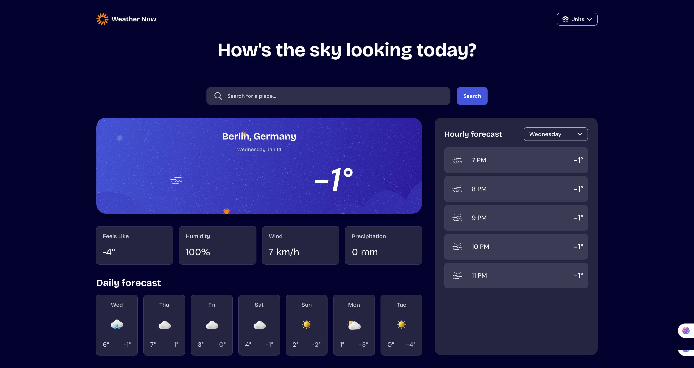

# Frontend Mentor - Weather app solution

This is a solution to the [Weather app challenge on Frontend Mentor](https://www.frontendmentor.io/challenges/weather-app-K1FhddVm49). Frontend Mentor challenges help you improve your coding skills by building realistic projects.

## Table of contents

- [Overview](#overview)
  - [The challenge](#the-challenge)
  - [Screenshot](#screenshot)
  - [Links](#links)
- [My process](#my-process)
  - [Built with](#built-with)
  - [What I learned](#what-i-learned)
  - [Continued development](#continued-development)
  - [Useful resources](#useful-resources)
- [Author](#author)

## Overview

### The challenge

Users should be able to:

- Search for weather information by entering a location in the search bar
- View current weather conditions including temperature, weather icon, and location details
- See additional weather metrics like "feels like" temperature, humidity percentage, wind speed, and precipitation amounts
- Browse a 7-day weather forecast with daily high/low temperatures and weather icons
- View an hourly forecast showing temperature changes throughout the day
- Switch between different days of the week using the day selector in the hourly forecast section
- Toggle between Imperial and Metric measurement units via the units dropdown
- Switch between specific temperature units (Celsius and Fahrenheit) and measurement units for wind speed (km/h and mph) and precipitation (millimeters) via the units dropdown
- View the optimal layout for the interface depending on their device's screen size
- See hover and focus states for all interactive elements on the page

### Screenshot



### Links

- Solution URL: [Add solution URL here](http://github.com/Robertron624/FM-weather-app)
- Live Site URL: [Add live site URL here](https://your-live-site-url.com)

## My process

### Built with

- Semantic HTML5 markup
- CSS custom properties
- Flexbox
- CSS Grid
- Mobile-first workflow
- [React](https://reactjs.org/) - JS library
- [Typescript](https://www.typescriptlang.org/) - Superset of JavaScript
- [Vite](https://vitejs.dev/) - Frontend build tool
- [Eslint](https://eslint.org/) - Linting utility
- [Babel](https://babeljs.io/) - JavaScript compiler
- [Sass](https://sass-lang.com/) - CSS preprocessor
- [React Context API](https://reactjs.org/docs/context.html) - State management
- [OpenWeatherMap API](https://openweathermap.org/api) - Weather data API

### What I learned

During this challenge, I learned how to effectively utilize the OpenWeatherMap API to fetch and display real-time weather data. I also improved my skills in managing global state in a React application using the Context API, which allowed for better organization and sharing of data across components. Additionally, I enhanced my CSS (SASS) skills by implementing a responsive design that adapts seamlessly to different screen sizes using Flexbox and CSS Grid. Here are some code snippets that I'm particularly proud of:

Main component structure with conditional rendering based on search results:

```jsx
<>
  <Header />
  <main>
    <h1>{headingText}</h1>
    <SearchBar
      onLocationSelect={handleLocationSelect}
      onSearchError={setSearchError}
    />
    {searchError ? (
      <div className="search-error">
        <p>No search result found!</p>
      </div>
    ) : (
      <div className="weather-content">
        <div className="desktop-left">
          {lat && lon && <WeatherCard lat={lat} lon={lon} />}
          {lat && lon && <CurrentStats lat={lat} lon={lon} />}
          {lat && lon && <DailyForecast lat={lat} lon={lon} />}
        </div>
        <div className="desktop-right">
          {lat && lon && <HourlyForecast lat={lat} lon={lon} />}
        </div>
      </div>
    )}
  </main>
</>
```

Responsive SASS styling for the weather content layout:

```scss
.weather-content {
  @include md {
    display: grid;
    grid-template-columns: 3fr 1.5fr;
    gap: 2rem;
  }

  .desktop-right {
    @include md {
      position: relative;

      > * {
        position: absolute;
        top: 0;
        left: 0;
        width: 100%;
        height: 100%;
      }
    }
  }
}
```

Hook for handling search functionality with debouncing and keyboard navigation:

```ts
export function useSearch({ onSearchError }: UseSearchProps) {
  const [query, setQuery] = useState("");
  const [results, setResults] = useState<LocationSearchResult[]>([]);
  const [isLoading, setIsLoading] = useState(false);
  const [showResults, setShowResults] = useState(false);
  const [selectedIndex, setSelectedIndex] = useState(-1);

  useEffect(() => {
    const timer = setTimeout(async () => {
      if (query.length >= 2) {
        setIsLoading(true);
        setShowResults(true);
        try {
          const locations = await searchLocations(query);
          setResults(locations);
          setSelectedIndex(-1);

          if (locations.length === 0) {
            onSearchError(true);
          } else {
            onSearchError(false);
          }
        } catch (error) {
          console.error("Search failed", error);
          setResults([]);
        } finally {
          setIsLoading(false);
        }
      } else {
        setResults([]);
        setShowResults(false);
        onSearchError(false);
      }
    }, 500);

    return () => clearTimeout(timer);
  }, [query, onSearchError]);

  const handleKeyDown = (e: React.KeyboardEvent<HTMLInputElement>) => {
    if (e.key === "Escape") {
      setShowResults(false);
      return;
    }

    if (results.length === 0) return;

    if (e.key === "ArrowDown") {
      e.preventDefault();
      setSelectedIndex((prev) => (prev < results.length - 1 ? prev + 1 : prev));
    } else if (e.key === "ArrowUp") {
      e.preventDefault();
      setSelectedIndex((prev) => (prev > 0 ? prev - 1 : -1));
    }
  };

  const resetSearch = useCallback(() => {
    setQuery("");
    setShowResults(false);
    setResults([]);
    setSelectedIndex(-1);
  }, []);

  return {
    query,
    setQuery,
    results,
    isLoading,
    showResults,
    setShowResults,
    selectedIndex,
    handleKeyDown,
    resetSearch,
  };
}
```

### Continued development

For continued development, I plan to enhance the user experience by adding features such as saving favorite locations, I want to improve accessibility by ensuring that all interactive elements are fully navigable via keyboard and screen readers. Finally, I aim to optimize performance further by implementing code-splitting and lazy loading for components that are not immediately needed and by also handling assets like images and icons more efficiently (having different resolutions for different screen sizes).

### Useful resources

- [Weather Forecast API Doc](https://open-meteo.com/en/docs) - This API documentation was incredibly helpful for understanding how to fetch and display weather data. Their clear examples and explanations made it easy to implement the necessary features in my project.
- [React Context API](https://reactjs.org/docs/context.html) - The official React documentation on Context API provided great insights into managing global state in a React application. It helped me understand how to share data across components without prop drilling.
- [React Custom Hooks](https://reactjs.org/docs/hooks-custom.html) - This section of the React documentation was useful for learning how to create custom hooks. It guided me in encapsulating logic related to search functionality and state management in a reusable way.

## Author

- Website - [Robert Ramirez](https://robert-ramirez.netlify.app/)
- Frontend Mentor - [@Robertron624](https://www.frontendmentor.io/profile/Robertron624)
- Github - [@Robertron624](https://github.com/Robertron624)
